「はじめに」で自分でキーボード基板を引くのが主題のひとつであると説明しました。
この章では実際にどのようにしてキーボードハードウェアを製造するべきだったかを解説します。
実際にこのとおり手順よくできたわけではなく、多くの回り道と失敗がありました。
たんなる手順書にとどまらず、今後STM32をつかった自作キーボード基板を設計する人ができるだけスムーズに成功できるためのヒントを書くようにしました。

なお、かならずしもRust Firmwareを動かすために自分で基板をつくる必要はありません。
ブレッドボードを使ったり、既存のキーボード基板をつかってもよいです。
ハードウェアの章とソフトウェアの章は独立の問題をあつかっています。

# 部品の調達

キーボード基板を作ろうと思ったとき、KiCADなど基板を開くところから始めるのはせっかちです。
KiCADで回路を組み立てる前にどんな構成にするか決めるほうがよいです。
とくにMCUを自由に選定すると選択肢があまりに多く、またどれを使うかによって必要な周辺パーツもかわってきます。
まずやりたいことを整理し、MCUを決定するところから始めるのが余計なパーツを買って後悔しないコツです。

MCUを選び始める前に、価格についての考えを示します。
MCUの価格の許容範囲は生産数で変わります。
千台売る予定があるのであれば300円のMCUと200円のMCUはそこそこの違いになりますが、5個であれば無視できます。
基板1枚の製造コストはおおむね4ドルから5ドル(5枚で20ドルから30ドル)のようです。
また周辺部品を使い切れる分くらい購入するとしめて200円から500円くらいになります。
これらと比較してMCUは500円以内程度であれば機能リッチでトラブルが起きづらいものを選択する方針としました。
他の部分でも、価格よりはリスクや手間をケチるようにしています。
わたしたちの時間もタダではないし、ミスってやりなおしになったらそのぶん追加部品の費用もかかります。
どれくらいのパーツをつかうかは自由ですが、あらかじめどれくらいの幅におさめるか決め、値段にひきづられないのが即決のコツです。

やりたいことをリストアップしてみましょう。
キーボードは通常コンピュータなどUSBホストにUSB接続します。
USB接続機能が必要です。
USB接続は、原理的にはGPIOをつかってソフトウェア制御で実現できますが、おすすめしません。
USB機能をサポートしているハードウェアを選択するのが無難です。

次にキー数を見積もります。キーマトリクス方式の場合はGPIOがキー数のおよそ平方根ぶん、GPIO直結の場合はキー数分必要です。
どんなキーボードレイアウトにするかおおまかに想像し、必要なGPIO数があるMCUを選びます。

左右分離にするならば左右通信のための機能が必要です。
よく使われるのはI2CやUART、USARTです。
これもMCUがハードウェアサポートしている方がよいです。

わたしがとった構成はUSBとI2Cだけのシンプルなものですが、PS/2接続をつかったりアナログピンで静電容量を取ることももちろん可能です。
そのために必要な機能やピン数をしらべましょう。
Bluetoothをつかうこともできます。日本国内で使うならば技適準拠したMCUであり、かつ自分が実装したものも準拠するよう考慮する必要があります。

通信をソフトウェアエミュレーションするべきでない理由ですが、タイミングが非常に厄介になるからです。
たとえばUARTであれば一定の間隔で入力を読み取ったり出力を切り替える必要があります。
ソフトウェア実装するとこの間隔が非常にあやしくなりやすいです。1つだけの通信を実装するならまだしも、USBとI2Cなど複数の通信を実装するとタイミング制御が複雑になり、ファームウェアの実装難度が不必要にあがってしまいます。
たしかにハードウェア機能をつかうためにマニュアルを読むのも億劫ですが、少ないデバッグ時間で安定した動作を得るためにハードウェア機能を使うことを強くおすすめします。

最後に、ぜひおすすめしたいのがデバッグサポートとDFUです。
デバッグサポートとは特定のピンに外部ハードウェアを接続し、コンピュータなどから動作状況を調べられる機能です。
コンピュータ内のプログラミングで使うデバッガがそのまま開発中のハードウェアでも使えるイメージです。
本格的なデバッグツールは高価ですが、ST-Linkの機能を実装したノーブランド品なら500円程度で購入できます。
ハードウェアを上からながめていても何もわかりませんので、なんらか中身を見る方法があると安心です。
デバッグサポートはほとんどのMCUに存在します。
STM32のデバッグサポートはSWDかJTAGの片方もしくは両方を提供します。
JTAGが5線必要とするのに対しSWDは2線で利用可能です。
SWD用の2ピン(SWCLKとSWDIO)をアクセス可能な基板設計にするとよいです。
これらデバッグサポートのピンを空けておいても他の用途に十分なピン数があることを確認しましょう。

DFU(USB DFU, Device Firmware Upgrade)はキーボードファームウェアをUSBで書き換える機能です。
わたしも調べる前はそんなの当然できるでしょと思っていましたが、STM32の、とくにMCU単体のものはできないものが多数あります。
有名どころでは、BluePillはできません。
STM32では上述のデバッガなどをつかって書き込むほうが一般的で、DFUサポートは限定的です。

また、非常に罠なのですが、MCUによってはDFUサポートがあると書いてあるにもかかわらず、使えないものがあります。
STM32F105/107がそうです。STM32F1シリーズは安価で販売している所も多いので、使えれば第一選択になるのですが、チップの版によっては使えません。
[STのAN2606](https://www.st.com/resource/en/application_note/cd00167594-stm32-microcontroller-system-memory-boot-mode-stmicroelectronics.pdf)から引用します。

> 14.3.2 Bootloader unavailability on STM32F105xx/STM32F107xx devices with date code lower than 937
> (中略)
> Workaround
> • For 64-pin packages
> None. The bootloader cannot be used. 

ひどい！この罠はしっかり踏みました。ひどすぎる。
いいかげんに購入したらどの版の石がくるかわからないので、こういうのは避けましょう。
AN2606はDFUサポートの優秀なMCUをみつくろうためにとても便利です。
各MCUのブートシーケンスが図示されているので、条件達成が容易そうなものをえらびましょう。

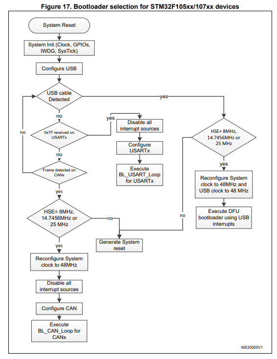

たとえばこの図では、DFUにHSEが必要なことがわかります。
HSEとは外部クロックソースです(内部クロックソースがHSI)。
すなわちSTM32F105/107でDFUをつかうには発振子も実装する必要があります。
HSIでもDFUが使えるもののほうがいいですね。

コアの種類にも注意が必要です。
STM32はST社が制作する32-bit Arm Cortex-Mプロセッサコアを搭載したMCUの意味ですが、Cortex-Mのなかにも種類があります。
Cortex-M0からはじまり、M0+、M1、M3とつづきます。
おおむね数字がでかいほうが強いです。
離散フーリエ変換でライトをいいかんじに光らせたいとか特殊な希望がある場合はそれに適った性能のコアを選択しましょう。
またM0、M0+、M1はARMv6という古いインストラクションセットを採用しており、レジスタも端折られているので、ファームウェア実装で苦労します。
自力で書く分はともかく、ライブラリが動かないとかなり大変な目に遭うのでCortex-M3以上を搭載したものがオススメです。
この点がなければSTM32F072もよろしいのですが。
よりしょうもない話ですが、Rustで書くならば、HAL(Hardware Abstraction Layer)が実装されているか、更新されているかも気にする必要がありました。
[stm32-rs](https://github.com/stm32-rs)では製品ラインごとにHALをべつべつで実装していて、微妙にnaming conventionもずれていたりします。
F系が充実していますが後述の理由で回路が複雑になるので、ほかでマシそうなやつを探しました。
使いたいライブラリがあれば、対応状況を確認してください。

やりたいことと必要なものがきまったら実際の[MCU一覧](https://www.st.com/en/microcontrollers-microprocessors/stm32-32-bit-arm-cortex-mcus.html)をみて選んでいきます。
以上でとりあげたのは次の項目です。

- USB DFU
- USB device
- I2Cなど
- キースイッチぶんのGPIO
- デバッグサポート(SW-DPあるいはSWJ-DP)
- 演算性能

ほかに物理ピン数、パッケージ形式なども気にする必要があります。
手ハンダするならリードのあるもの(LQFP)を選択する必要があります。裏面パッドははんだゴテではんだ付けできないので詰みます。
物理ピン数は多すぎるとはんだ付けが面倒です。少なすぎるとGPIOが不足します。
RAMサイズ、Flashサイズはさほど気にする必要はないかと思います。複雑なことをしてRAM、Flashがたくさん必要なのでなければ入手性を優先してよいでしょう。

驚くべきことに、USB DFUの条件が一番厳しいのでこれで絞って、のこりの条件を満たすものを見つけるのがよいです。
STM32Fxxx系はすべてHSEを要求します。オシレータをのせたり回路を調べるのは面倒でしょう。
STM32G4xx、H4xx、H7xx、L4xx、L5xxはどうもHSIでのDFUをサポートしているようです。
正確にひとつずつみてはいないので、ねんのためAN2606で確認してください。

なおUSB DFUを要求せず、かわりにデバッガ(ST-Link等)相当の機能を基板上に実装することもできます。
NucleoなどSTM32を載せた開発ボードはたいていこのような構成になっています。
部品点数は増えますが、デバッグまでワンストップでできる利点があります。
わたしは最小部品数でやりたかったので、この方法は検討していません。

以上の条件を考え、わたしはDFUのあるなかでいちばん安そうでHALが動きそうだったSTM32L412を利用しました。
もちろんどれでもよいですが、STM32L412はすくなくとも問題なく動いているのでオススメです。

MCUを決めたらMCUが要求する回路を調査します。

部品を決めたら回路図を作成しつつ部品を購入します。
間違いがみつかるかもしれないので発注するのは回路図や基板が書けてからのほうがいいでしょう。
しかし入手性を確認する必要もあるので、どこでなにを買うのかは先に調べたほうがよかったです。
STM32の石はポピュラーなものはAliExpressやAmazonでも販売していますが、マイナーなものはMouserやDigiKeyに発注する必要があります。
どちらも海外発送で送料がたかいですが、6,000円以上で送料無料になるのである程度まとめて、ほかの部品も一気に購入しましょう。
必要数ギリギリに買うのはオススメできません。
小さい部品を紛失したり、はんだ付けに失敗するリスクはかなり高いです。
最低必要数の倍くらい購入しておくと安心です。
配送はかなり早いです。まず基板より先に到着します。

MCUを決めたらその周辺に配置する部品も決めねばなりません。
MCUが要求する部品もありますし、自分が作りたいキーボードの機能のために用意するものもあるでしょう。
たとえば左右分離する場合は通信ケーブルを接続する端子が必要です。
自作キーボードではTRRSケーブルを使っているものが多いです。
またキースイッチを直接はんだ付けするのか、キースイッチソケットを使うかといった判断もあります。

今回はMCUをSTM32L412C8に、左右の通信をI2Cに、Kailhのソケットを利用し、スイッチはGPIOとGNDの間に直接配置しキーマトリクスは使わない方針としました。
次の「回路図の作成」からはこの構成を念頭に書いていますので、異なる箇所は読み替えてください。

# 回路図の作成

回路図を書くには必要な部品を調べるところから始めましょう。
MCUやその他のキーボードの中心となる機能を担う部品はすでに決めました。
次はそれらの資料を確認しながら間を繋ぐ部品と接続の方法を調査します。
KiCADなど基板CAD上でそれらを実際に配置したら回路図の作成は完了です。

今回はKiCADを使っています。
操作の流れは記載していないので、基本的な操作方法は[KiCAD使い方](http://www.kicad.xyz/circuit/)などで確認してください。

今回作成した回路図は次のとおりです。
ひとつずつ要素を分解して見ていきます。
理由を理解すればいずれもシンプルな回路です。

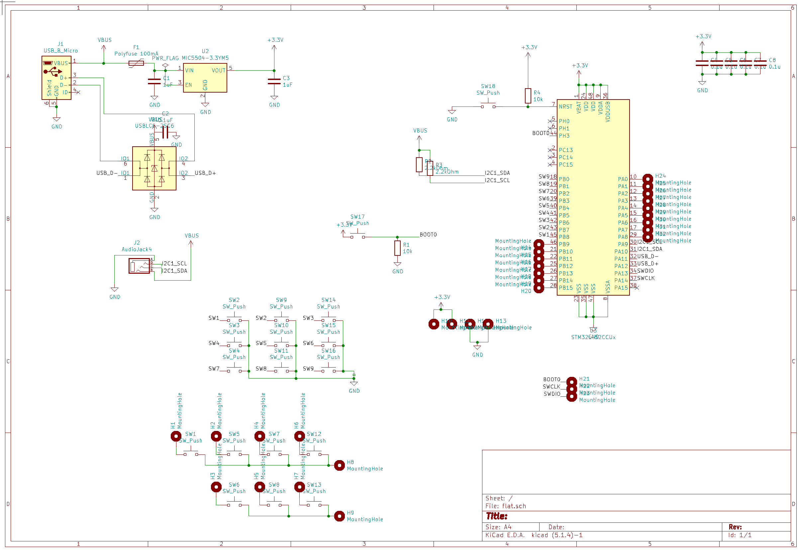

## MCU

ST社が回路設計のマニュアルを公開していますので、ここから始めましょう。
STM32L4の場合
[AN4555 Getting started with STM32L4 Series and STM32L4+ Series hardware development (PDF)](https://www.st.com/resource/en/application_note/dm00125306-getting-started-with-stm32l4-series-and-stm32l4-series-hardware-development-stmicroelectronics.pdf)
がドキュメント一覧にみつかります。

一番気をつけるべきは電源線(VCC、GND)の扱いとBOOT、Resetの結線です。
電源線が正しく実装されていないと動作が不安定になったり故障のリスクが増大します。
BOOTとResetが正しく用意されていないと一度アプリケーションを書き込んだらDFUに戻れなくなってしまうかもしれません。

マニュアルを見るといろいろ注意が書いてありますが、Reference designどおりにしておけばまず間違いはないでしょう。
実際に基板上に部品を配置するときの注意も各所に書いてあります。
各々参照するのが望ましいですが、まず全体像を把握しましょう。

いま参照している版では8.2がComponent referenceで、必要な要素が列挙されています。
Table 18. Mandatory componentsを見ると必須なのはMCUのほかいくつかのキャパシタだけのようです。
資料から引いた図でオレンジ色でかこった部分が必須のキャパシタです。
これらはdecoupling capacitor、すなわち相互の電源電圧に対する影響を排除する目的で挿入されるものです。

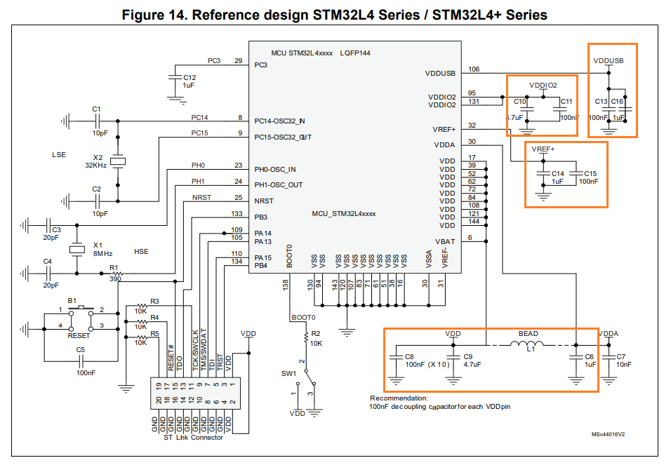

2.3 Power supply sequence between VDDA, VDDUSB, VDDIO2, VLCD and VDOをみるとVDDが1V以下に下がりうる場合はこれらの電圧にケアが必要であると記述されています。
しかし今回はキーボードであり、つねにコンピュータなどUSBホストから一定の電圧が給電される想定ですから、この部分は割愛してよいでしょう。
わたしの実装では簡略化してすべての電源を同等に扱い、電源ピンとGNDの間に0.1uFのキャパシタを挟みました。

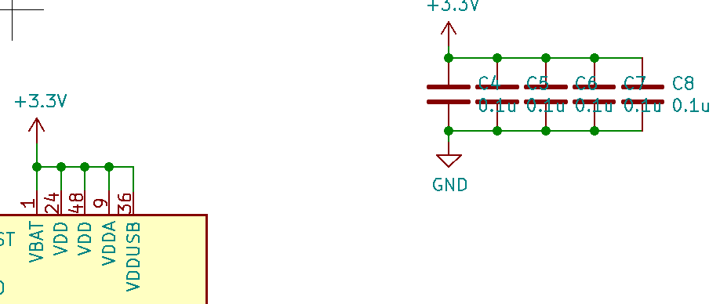

次に各VDDの電圧範囲を確認しましょう。
VDDUSBは電圧範囲が3.0Vから3.6Vで、一番タイトです。
ほかのVDDはこの範囲で動作します。
この電圧が狂うとUSB機能が正常動作しなくなります。
またUSBの生の電圧である5Vではありません。
USBからMCUに電源供給する方法を考える必要があります。
次の節で扱います。

## USB

キーボードをUSB接続するためにUSB端子を基板上に設置します。
USB端子は電源に関係するVCCとGND、信号に関係するD+とD-で構成されます。
端子はmicro-BでもUSB-Cでも、電源線に来る電圧は+5Vです。
上述のように5Vをそのまま供給することはできませんし、端子には静電気や電圧の不安定が発生するリスクもあります。

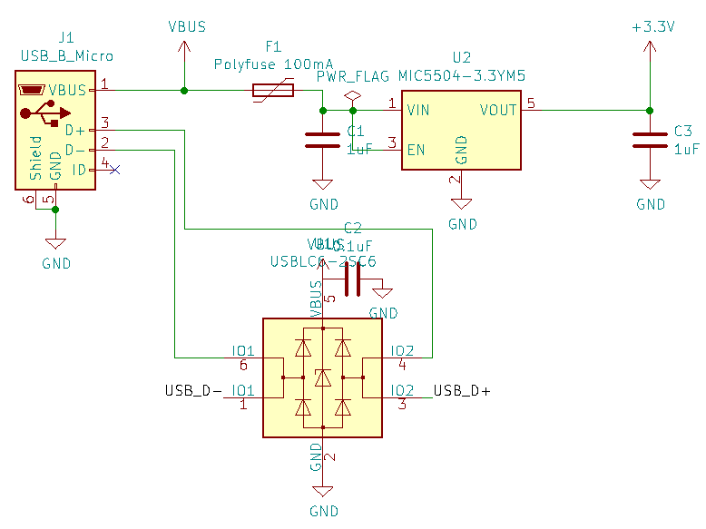

電源をコントロールする目的でこのような電源回路を配置しました。
要素を順にみていきましょう。左のUSB_B_MicroがUSB端子です。ここにUSBケーブルが繋がります。
このなかでVBUSとGNDに注目しましょう。
GNDは直接基板全体のGND(GNDベタ)に接続されます。
VBUSはI2C用によけているのと、Polyfuseにはいっている線があります。
PolyfuseはResettable fuseとも呼ばれ、過剰な電流が流れたときに回路、特にMCUを保護します。
これがないと静電気などでMCUに過電流が流れ、破損するリスクがあります。
次に3.3Vのレギュレータ(U2)が来ます。
レギュレータは入力電圧から小さい、安定した出力電圧を作る部品です。
これのおかげでMCUに3.3Vの安定した電源が供給でき、上述の問題が解決されました。
レギュレータも左右にdecoupling capacitorを入れるよう指示されるものがほとんどです。
レギュレータの説明書にどれくらいの容量をいれればいいか記載しています。
最もコンパクトなものはIN、OUT、GNDの3ピンですが、このようにEN(Enable)やNC(Not connected)があるバーツもあります。
各ピンがどういう役割かデータシートで確認しておきましょう。

レギュレータとPolyfuseは入手性のよいもの、はんだ付けのしやすいものを適当に選択しましょう。
スペックで重要なのはレギュレータであれば入力電圧範囲に5Vが含まれていること、出力電圧が3.0-3.6V内であることです。
Polyfuseであれば回路で要する電流にちょっと余裕があるくらいの、多すぎない電流で遮断が走るものをチョイスしましょう。
表面実装だからと気合をいれてやたらちっちゃいものを選ぶとはんだ付けがやたら大変です。
大きいものは逆に足が広くてはんだ付けしづらかったり、回路サイズが無駄に増えてしまいます。

USBLC6も解説します。
いままでは電源線の保護を考えましたが、USBの信号線、D+、D-も外部から来る線なので、静電気等の対策を行うべきです。
USBLC6はこのための部品です。
詳しい仕組みはカタログに記載がありますが、静電気対策のほかD+とD-(これらは通信中つねに反対の電位にあります)のバランスを調整します。
雰囲気で言えば信号をキレイにしてくれるものです。

基板設計の片足をつっこんでしまいますが、USBポートの選択肢について補足します。
ここまでUSB micro B端子を使う前提で話していますが、ProMicroを長く使っていればわかるように、USB micro B端子は強度問題が生じやすいです。
シールドの足を基板に埋めるタイプの端子を使えばかなり改善しますが、挿抜はかなり力がかかりピンピッチは狭く丁寧なはんだ付けが求められます。
もげてしまうと基板の接点ごと死ぬので、全部作り直しで悲しいです。

2つ代案があります。
ピンピッチはより細かくなりますが、はんだ付けしたときの強度はUSB-Cレセプタクルのほうが上げやすいようです。
USB-Cのピンはたくさんありますが、USB 2.0互換のD+、D-、VCC、GNDだけ配線しておけばUSB 2.0モードで動きます。
ペリフェラル側がUSB-C、ホスト側がUSB-Aのケーブルであれば単に端子を置くだけですが、USB-C同士のケーブルで利用する場合2つあるCCピンをRd抵抗と呼ばれる5.1KΩ抵抗でプルダウンする必要があります。
詳しくは「usb-c cc rd resistor」で検索してください。
USB-Cレセプタクルを使うならばこの抵抗も回路図に盛り込みましょう。

もう1つはDIP化キット[秋月ブレッドボード用マイクロＢメスＵＳＢコネクタＤＩＰ化キット](https://akizukidenshi.com/catalog/g/gK-06656/)などを使う案です。
既製品で強度も高いし、万一もげてもDIP部分だけはんだを外して付け替えられます。
電源用ではなく信号線も出ているものを選択してください。
端子形状が異なりますが生のUSB micro B端子とピン構成は同じな点も分かりやすいです。
デメリットは基板の高さがすこし嵩んでしまうことです。

## キースイッチ・マトリクス

キースイッチの選択はこの文書の範囲外ですが、あまりキースイッチを触ったことのない方のためにいくつか注意点を述べます。
回路図を描く段階ではスイッチはただの2端子の部品ですが、基板を起こす段階ではフットプリントを意識します。
キースイッチのフットプリントはスイッチによって異なります。
普及しているもの同士ではCherry MX互換品とKailh等のロープロファイル品が非互換です。
またスイッチソケットを利用する場合もソケットによってフットプリントが異なります。

基板を裏表で使えるようにすると思うならばさらに注意が必要です。
MCUを直載せする場合MCUの部分を両面に作るのは作業負担が大きく、短絡等のリスクも増大するので一方向のみで利用する設計がおすすめです。

裏表にするか、どのタイプのスイッチを使うか、ソケットを使うかを考慮してフットプリントを決定しましょう。
回路図の上ではスイッチを必要数並べるだけです。

1つのスイッチを1つのGPIOに対応づけるのか、キーマトリクスを構成するかが次の論点になります。
キーマトリクスとはキーボードをN行M列の行列とみなし、行に順に電圧をかけ、その間に列の電位を見ることでどのキーが押されているか特定する方法です。
i行に電圧をかけているときj列の電位変化があれば(i,j)の位置のキーが押されていると判断できます。
電圧をかける方向とセンシングする方向は逆でもかまいません。
1つのスイッチに1つのGPIOを対応づけると当然キー数ぶんの余剰GPIOが必要です。
この方法であれば行数+列数で済むので、最小キー数の平方根の倍のGPIOで済みます。

自作キーボードはProMicroを利用するものが多く、ProMicroのピン数は少なめなので、キーマトリクス方法を採用しているものが多いです。
キーマトリクスを採用する場合、誤検知を防ぐためダイオードを入れるべきです。
そのため目にする自作キーボードキットの多くはダイオードをたくさんはんだ付けする設計になっています。

MCU直載せであれば自由に足の数を選べるのでGPIO直結も可能です。
GPIO直結の利点は部品点数が節約できることの他に、キーに特殊な意味を持たせやすいこともあります。
GPIOと他の機能を切り替えられるピンにキースイッチを接続することでMCUのハードウェアに直接キー押下で指示を出せます。
スリープ解除、ブートモード切替などのユースケースが思いつきます。
ただし、足の数が増えることでICのサイズが大きくなるため基板上で配置できる場所に制約がかかる、基板設計で線を引き回すのが面倒というデメリットがあることも留意しましょう。

今回は直結を試してみました。
しかし実際につくってみるとやはりキー数が少なすぎたかなという感じもあります。
3Dプリントしたケースでキーの角度を調整したかったこと、大きい基板を発注するとお金がかかることから、一部キーをモジュール化し、MountingHoleで後から配線するシステムにしています。
最大25キー接続できますので3x7(4本指のゾーン)+4(親指ゾーン)、あるいは4x6+1をイメージしています。

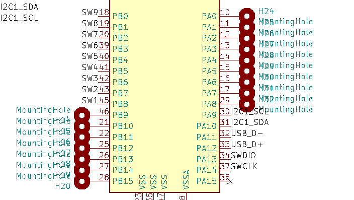

キーマトリクスの実装をする場合は原理を理解しスキャン方向をあらかじめ決定する必要があります。
ここで実装方法は解説しません。
[オリジナルキーボードを作ってみる その7「キーマトリックス」-ゆかりメモ](https://eucalyn.hatenadiary.jp/entry/original-keyboard-07)や[キーマトリックス](https://www.ei.fukui-nct.ac.jp/~t-saitoh/exp/h8/key-matrix.html)が参考になります。

## I2C用のTRRSジャック

左右分割キーボードの場合、左右のMCU同士の通信メカニズムが必要です。
通信メカニズムはMCUがサポートしているもののうち使い慣れているものということでI2Cを選択し、接続ケーブルはTRRSを使うことにしました。
なお、自作キーボードの慣習としてTRRSやI2Cを外部コンポーネントとの通信で使っていますが、この選択はかならずしもベストではありません。
キーボードは通信速度も信頼性の要求も低いので現実に動作しますが、設計面でよりよい選択肢はあるかもしれません。

模式図は次のようになります。
この構成は完全に左右対称です。
左右で同じ基板を使い回すことができます。

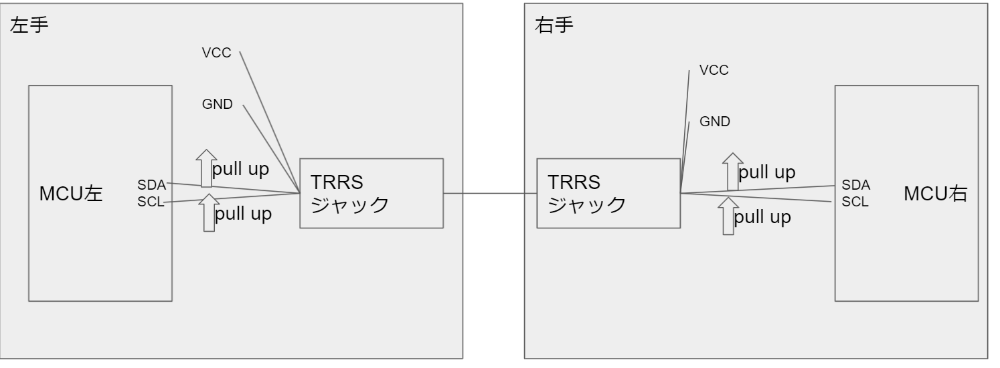

STM32L412はI2Cに利用できるピンを複数組提供していますが、ドキュメントの一番上に書いてあるもの、すなわちI2C1のパターン1を使うのが無難です。
データシート上ではAlternate Functionのなかで`I2C1_SCL`、`I2C1_SDA`などと記載されています。
STM32L412の場合PA9とPA10がこれに対応します。
このピンをTRRSジャックの足に接続します。

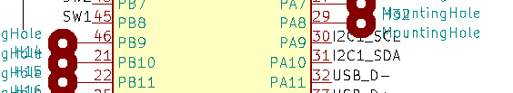

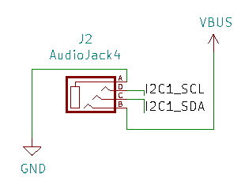

VCCとGNDはUSBから貰ったものをそのまま反対側に渡しています。
TRRSもジャックですので、静電気などの影響をうけることが予想されます。
そのため反対の基板でもヒューズやレギュレータを利用するべきと考えました。
信号線にも静電気対策をするべきですが、適当な回路がわからなかったので今回は対応しませんでした。

なお、このVCCとGNDの配列は問題があるかもしれません。
左右両方にUSBケーブルを接続した状態でTRRSを挿抜すると短絡が起きUSBが停止されるかコンピュータごとクラッシュすることがありました。
PC側で保護されているmac bookはUSBデバイスの停止で済みましたがWindowsラップトップはクラッシュしました。
通常片側ずつ接続する、ホットプラグしないよう注意が必要です。
正しく修正できたら更新します。

I2Cの信号線はプルアップが必要です。
プルアップとは、IC等がその信号線を制御していない場合の電位をビット表現で1に固定するための回路上の処置です。
I2Cの通信プロトコルではSDA、SCLがともに1のとき通信路が使われていないと決まっています。
逆に、誰も使っていないにもかかわらず勝手にSCLやSDAが0になってしまうと未使用にもかかわらず使用中に見え、だれにも使えない状態になってしまいます。
ICが停止していたり接続されていない場合は常に1になるべきです。
このための回路上の処置を、電位を引き上げるという意味でプルアップといいます。

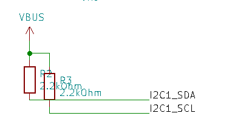

プルアップの仕方は簡単で、適切な大きさの抵抗をVCCと信号線の間にいれるだけです。
VCCと信号線の間が接続されるので、誰も線に接続していないときはVCCと同じ電位になります。
誰かが制御しているときは抵抗が入っているためVCCに引っ張り上げられることはありません。
抵抗値の計算を正しくやるためには回路のキャパシタンスを求める必要がありますが、利用者がケーブルを使うかもわからないで計算できるわけもないので、適当に決めます。
I2CのStandard mode(100kHz)の場合4.7kΩという値がよくでます(例: [Sparkfun tutorial](https://learn.sparkfun.com/tutorials/i2c/i2c-at-the-hardware-level))。
今回は手元に余っていた抵抗を適当に使いました。
抵抗値が低すぎるとVCCに引きずられ信号レベルがただしく0にならない、抵抗値が高すぎると信号の切り替わりが遅くなり意図せず前の信号を読んでしまうリスクがあります。
特にI2CをFast mode(400kHz)で使いたい場合は抵抗値を1/5程度に下げないといけないようです。
詳しくは[I2C Bus Pull-Up Resistor Calculation (PDF)](https://www.ti.com/lit/an/slva689/slva689.pdf)などを確認してください。

## BOOTやデバッグ

開発ボードを利用する場合は開発ボードがよいかんじに設計されているのであまり気にしませんが、MCUを直接取り扱う時はブートモードの切り替えやデバッグ手段についても考えて基板設計する必要があります。
MCUの選定の箇所でDFUとデバッグサポートを紹介しました。
この節では実際にこれらの機能を利用するためのハードウェア上の準備を確認します。

デバッグサポートはいちばん必要なピン数がすくないSerial wire debug port (SW-DP)を利用します。
SW-DPを使うデバッグプロトコル規格がSWD (Serial wire debug)です。
STM32L412ではSWDIO(PA13)とSWCLK(PA14)にST-Link等のデバッグハードウェアを接続しSWDが利用できます。
STM32のMCUのほとんどで同機能が提供されています。
あとからMCU上のピンにデバッグハードウェアを接続するのは大変なので、この2ピンもMountingHoleで取り出しておきます。
VCC、GNDとあわせ、基板上の結線しやすい場所に穴を配置しましょう。
あわせてST-Linkを購入する場合SWDをサポートしていることを確認しましょう。

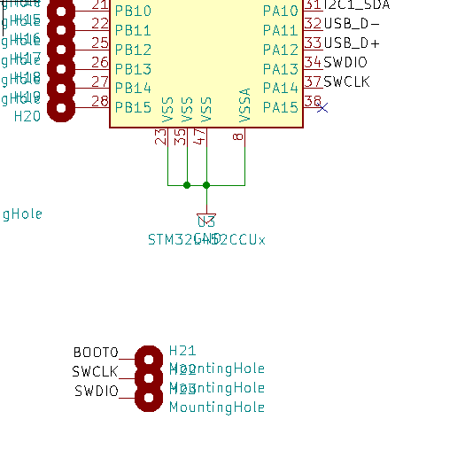

実際にデバッグするときはジャンパワイヤ等を直接はんだ付けして利用します。

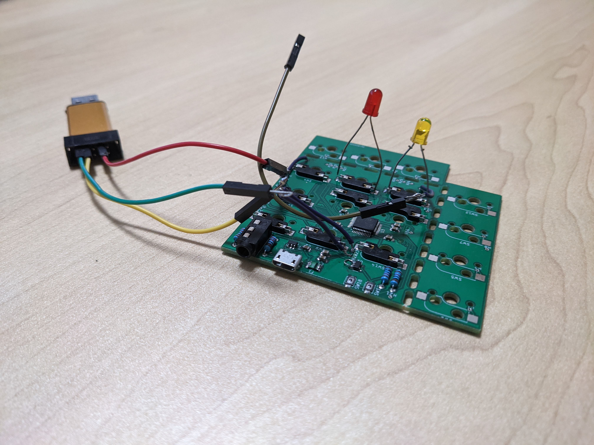

最後にBOOTです。
再度AN2606やデータシートを確認し、DFUに入るための条件を確認しましょう。
SWJ-DPがあれば最悪そこからファームウェアを書き換えられますが、通常利用時に毎回ST-Linkを接続するのはとても面倒です。
STM32は一般に何も設定していない状態でのブートはユーザが書き込んだファームウェアがあればそれをブートする、なければシステムファームウェアをブートするとなっているようです。
USB接続状態でシステムファームウェアがブートされるとDFUが起動します。

逆に、一度ユーザファームウェアを書き込んでしまうと次からシステムファームウェアに入るためになんらかの工夫が必要です。
STM32L412にはBOOT0というピンを制御する方法とnSWBOOT0というオプションビットを制御する方法があります。
BOOT0ピンは物理的にスイッチなどで制御します。
具体的にはリセットボタンを押す→BOOT0を押す→リセットを離す→BOOT0を離すと操作するとBOOT0が押下された状態で起動され、システムファームウェアに入ります。
nSWBOOT0オプションビットはプログラムやJTAGから変更可能な内部レジスタにあります。
プログラムでこのビットを制御してからリセットをかけることでもシステムファームウェアに入れます。
キー操作でDFU待ち受け状態にしたいときに利用できます。

nSWBOOT0を書き換えるプログラムがうまく動作しないとシステムファームウェアに戻れなくて詰むので、BOOT0もアクセスできるようにしておきましょう。
普段使わない想定ならばMountingHoleをつくっておくだけでもよいですが、わたしは特に開発初期に頻繁に使うと予想し物理スイッチを配置しました。

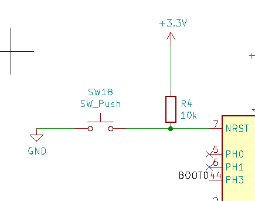
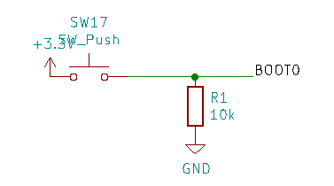

nRSTはLOWでON、BOOT0はHIGHでONです。
nRSTの先頭のnは電位値と真偽値が逆転(negate)していることを意味します。
nRSTはスイッチを押していないときVCC電位、押しているときGND電位になるべきです。BOOT0は逆です。
回路はnRSTはプルアップしスイッチの先をGNDに接続、BOOTは逆にプルダウンしスイッチの先をVCCに接続します。
プルアップ抵抗値は適当です。人間が触るボタンなので、本当に適当です。

以上で回路図の説明はおしまいです。
冒頭の回路図が理解できるようになっているのではないでしょうか。
実際にご自身のキーボードを設計することもできそうな気がしませんか。
実際にやってみてわからないことがあったらまず製品マニュアルを読みましょう。
それでもよくわからなければ質問してください。

# 基板の作成

回路図が書けたらあとは基板の上に好きにパーツを配置して配線するだけです。
基板にパーツを配置するための準備から始めましょう。

## 回路図を完成する

いま書けた回路図は回路設計を表現するには十分ですが、基板を作り始めるには不足があります。
パーツに通し番号をつける、ルールチェックをする、フットプリントを関連づけるという3つの作業が必要です。
KiCADではこの左上の一番右のボタン群を順につかいます。

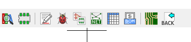

メモマークに似た「シンボルをアノテーション」は回路図上に配置したスイッチやMCUに通し番号をつけます。
MCUはUn、スイッチはSWnなどのネーミングルールにそって、順にU1、U2、U3など通し番号がついていきます。
基板を製造した後にどの部品をどこに置くかわかりやすくなります。
とくにキャパシタや抵抗はフットプリントがまったく同じで値が違うことが多いですから通し番号を確認すると間違いなく作業できます。
とくにこだわりがなければ何も設定せず「アノテーション」を押せばおしまいです。
あまりありませんが、エラーが出たら修正してください。

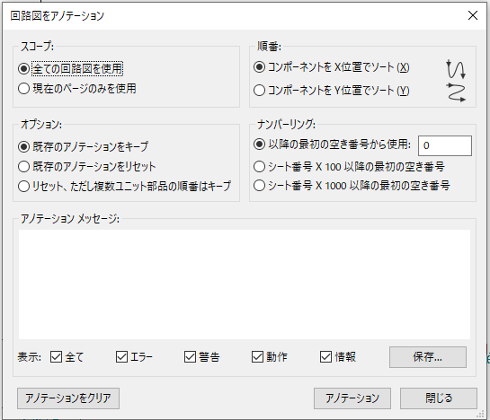

次にERC、Electrical rule checkを行います。
ERCは回路上の間違いっぽい部分を自動検出する機能です。
ソフトウェアプログラミングをやっている人はlint機能をイメージするとよいでしょう。
画面を開いたら「実行」を押すだけです。
たとえば次のように不要な端子(PH0)をそのままにしていると怒られます。
画面右側のバツを配置し未接続であることを明示すると解消できます。

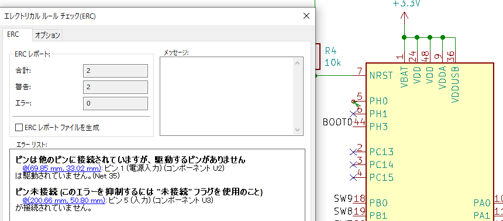

もうひとつのエラーはレギュレータのVINが電源線で駆動されるべきだがされていない、というエラーです。

.png

回路上はまちがいなく電源線で駆動されています。
KiCADのシンボルライブラリに設定されている情報をもとにERCを行うので、その情報が不適合だと意図せぬエラーがでることがあるようです。
エラーを回避するため、電源シンボルリストからPWR_FLAGを追加します。

.png

最後にフットプリントの関連づけを行います。
ダイアログを開くとシンボルの一覧が表示されます。
最初はなにもフットプリントを関連づけていないので、中央のペインの右端のカラムは空です。
上のパーツから順にどのフットプリントを利用するか決めます。
左端のペインからライブラリのグループを選択すると右端のペインに一覧が表示されますので、設定したいものをダブルクリックします。

操作はこれだけなのですが、ここで設定したフットプリントの部品の実物を用意しなければならないのでいいかげんに設定できません。
どれを設定するべきか決定するのが面倒です。
またフットプリントが標準インストールされていない場合はネット上から探すか自分で作成します。
これも面倒です。
実直にこなしていくしかないですが、いくつかヒントがあります。

まず[List of KiCad Keyboard Parts Libraries](https://wiki.ai03.com/books/pcb-design/page/list-of-kicad-keyboard-parts-libraries)などを参考にキーボード基板向けライブラリを入れましょう。
これでスイッチ・スイッチソケット・TRRSジャックは概ねカバーされます。

次にMCU用のフットプリントはかならず正しいと確信できるものを使いましょう。
ピン数、パッケージが一致するものを選びます。
手ハンダする場合は足がすべて外部にでていて基板下の端子がないパッケージを選択します。
ピン番号はマークのあるところを始点に反時計回りというルールなのでピン数と足の形が合っていれば使えます。
念の為データシートとフットプリントの詳細を見比べて同じに見えることを確認しましょう。
図は https://www.st.com/en/microcontrollers-microprocessors/stm32l412kb.html からダウンロードできるデータシートから引用しました。

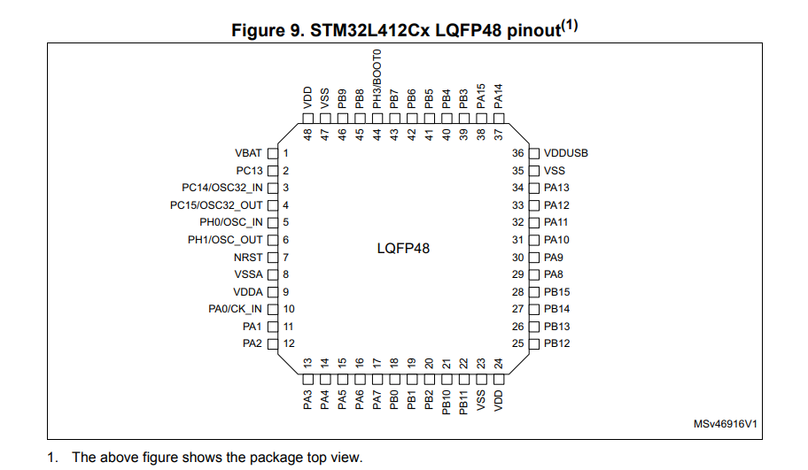
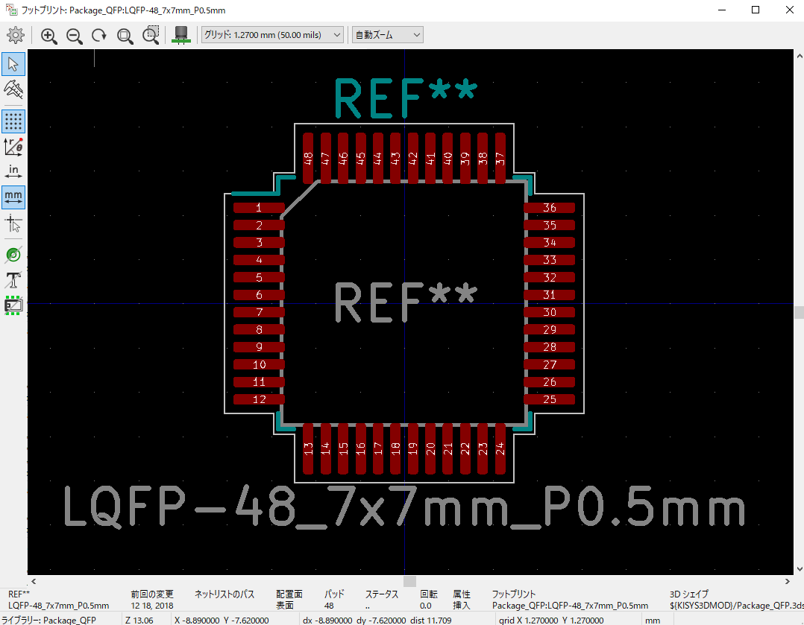

こまごました表面実装部品は寸法だけで決まります。
たとえば表面実装キャパシタのフットプリントはCapacitor_SMDというライブラリに収録されています。
やたらたくさんありますが、C_XXXXではじまりHandSolderとついているやつを選べばokです。
`Capacitor_smd:C_0805_2012Metric_Pad1.15x1.40mm_HandSolder`はその一例です。
XXXXの部分は表面実装部品のサイズ規格で、0805だったら0.08in x 0.05inです。
2012Metricはメートル表記で、2.0mm x 1.2mmの意味です。
Mouser等部品販売サイトでもこの規格名で検索できます。
HandSolderは手ハンダ用にはんだ付け部分が大き目になっているフットプリントです。
あまり小さいとはんだ付けしにくいので、今回は2012Metricを使いました。
もうすこし大きいものでもよいでしょう。

USBLC6やレギュレータといったもうすこし大きい部品も規格化されたパッケージを使っている場合が多いです。
USBLC6はSOT23です。レギュレータもこれにあわせSOT23のもの([MIC5504-3.3YM5 (PDF)](http://ww1.microchip.com/downloads/en/DeviceDoc/MIC5501-02-03-04-300mA-Single-Output-LDO-in-Small-Packages-DS20006006B.pdf))を選択しました。
SOT23のフットプリントは`Package_TO_SOT_SMD`にまとまっています。
それぞれ6ピン、5ピンなので`SOT-23-6`と`SOT-23-5`を選択します。
MCUとおなじくフットプリントエディタと使いたい部品のデータシートを比較して間違いないことを確認しましょう。

一番の難関はUSBでした。
USB Micro-Bレセプタクルのフットプリント自体はたくさんありますが、わたしが購入した部品がいいかげんなやつだったのでどれが適合するかわかりません。
目測でえいやで合わせましたが、はんだ付けがかなり大変だったのでデータシートのしっかりした、KiCADにフットプリントのはいっている製品を選択したほうがよいです。
似たように見えて微妙に異なり、ピンピッチが狭く挿抜で力もかかるので微妙な差が命取りになります。
文字通りキーボードが壊れて動かなくなります。
回路図の部分で紹介したようにUSB-CやDIP化キットを使う方法もあります。

## 基板を完成する

回路図がただしく書けていれば基板作業はやるだけなのであまり解説がありません。
フットプリント割付がおわったら部品を配置していきましょう。
操作手順は[【KiCAD】PCB設計（初期設定から部品配置まで）](http://www.kicad.xyz/pcb-setup/)などほか資料を参照してください。
画面上にばらまかれたパーツを好きなように配置します。
このときパーツ同士が干渉しないよう注意します。
USBやTRRS端子はケーブルと基板、ケーブルとケースが干渉しないようにも注意が必要です。

パーツを配置したら配線を行います。
手で引いてもいいですが、MCUがあると線の数が増え大変なので[freerouting](https://github.com/freerouting/freerouting)など自動化を利用することも検討してください。
配置によっては配線不可能になる場合もあります。
そうしたら戻って修正しましょう。
わたしは手でちまちま引いて数日かかりました。えらい大変な目に遭いました。

適宜Design rule check(DRC)を実行するとよいです。
線の間隔やビアの位置はいろいろいじくってるあいだにおかしくなることもありますので、早めに気がつくと修正が楽です。
最後はDRCを実行してから発注先の基板製造業者のマニュアルどおりに出力します。
シルクになにが乗っているか確認しましょう。実装の際パーツ番号やPin1マーク、極性がシルクで読める状態になっているとずいぶん楽です。
審美性のため省略することもありますが、まずは残しておくのが良いでしょう。

2021年春現在、中国の業者に発注する場合、基板が100mm x 100mm以内だと$5程度、送料が$20程度が相場のようです。
基板製造は安くなっていることがよくありますが、結局送料がそこそこするので大差はありません。
以前は国際郵便でもちゃんと来ましたが、COVID-19の影響で流通が滞っているため送料をかけてまともな配送するほうがよいようです。
PCBAは業者によって品質に大きな差があるようですが、特殊なシルクやパターンのないPCB製造のみであれば大差ないと感じますので気に入ったところに注文しましょう。

# 基板の実装

基板と部品を受け取ったらいよいよ実装です。

## 工具の用意

はんだ付けをするだけですが、工具や計測器があるとより効率的に作業を進められます。
とくに今までスルーホールのはんだ付けしかしたことがない場合、表面実装部品のはんだ付けには違ったコツがありますので確認してみましょう。

はんだ付けに必須の道具ははんだごて、はんだ、フラックスです。スルーホール部品がある場合はニッパも必要です。
あったほうがよい道具はピンセット、ルーペ、はんだ吸い取り線、導通テスター、工作マットです。
工具をまだ揃えてない人は[Helix キーボードキットの製作に必要な工具メモ](https://gist.github.com/mtei/6957107a676ddfa85bde0ae41f8fa849)や[自作キーボードを作るために必要な工具](https://salicylic-acid3.hatenablog.com/entry/tool-lubrication)を参考にしてください。
ここではMCUや表面実装部品に限定して確認します。

表面実装部品に使うはんだごては次の2点を注意します。

- 温度が上がりすぎないか
- こて先の形状は適当か

温度が上がりすぎるとICを壊してしまいます。
せっかくはんだ付けできても動かなければ元も子もありません。
270℃程度の一定温度を保てればよいのですが、温度調節機能付きのはんだごてを使うのが一番簡単です。
こて先の形状はとくに引きはんだをするとき重要です。
[HAKKO FX-600](https://www.hakko.com/japan/products/hakko_fx600.html)がよく利用されます。
わたしも使っています。

はんだごてはこて先を交換できます。
作業内容に応じて交換することで効率が上がります。
HAKKOのサイトにこて先の選び方がのっています。
[チップ部品のはんだ付け](https://www.hakko.com/japan/tip_selection/work_chip_parts.html)と[引きはんだ](https://www.hakko.com/japan/tip_selection/work_drag.html)の方法を確認し、どちらにも使えるこて先を選択するのがよいでしょう。
標準のB型でも可能ですが、わたしはBC型を使っています。
同じ形状でも複数の大きさがあります。
あまり大きなこて先だと隣の部品に触ったりしますので、自分の使っている部品に合うサイズを選びましょう。
小さすぎると効率的に加熱できず失敗します。

はんだは太すぎないものを選択します。
細い方が送り量だけで供給するはんだ量をこまかく調整できるので効率的です。
わたしは0.6mmのものをつかっています

とくにMCUのはんだ付けをするときフラックスは必須です。
ブリッジなど修正するときにも効率が上がりますので用意しましょう。
フラックスの効果は[フラックスの役目と種類](https://handa-craft.hakko.com/support/flux.html)などに詳しいですが、このなかで表面張力を低下させる効果がMCUはんだ付けに有用です。
フラックスを拭き取るためのアルコールなども用意します。

ピンセットはいわゆる精密ピンセットが必要です。
部品をつまんだりおさえたりするのに使います。
手で触ると皮脂がついてはんだ付けがしにくくなりますし、小さい部品を指でおさえてはんだ付けをするのは熱いし狭いし大変なので、ピンセットを使います。
わたしは先端のとがりすぎていない、先端が平面に見えるくらいのピンセットがおすすめです。
とんがっているものは刺すと痛いですし、パーツを点で保持するので微妙な力の狂いでずれたりとんでってしまいます。
ほんのちょっと面になっていると小さなパーツをしっかりおさえられます。

ルーペはMCUなど足が密集しているパーツの位置あわせとはんだ付け結果の確認に使います
LQFNの端子の幅は0.25mm、端子と端子の間隔も0.25mmです。
きれいにはんだ付けできていればいいですが、足の根元とかさきっちょとか、ほんのすこしだけもしかしたら短絡しているかも？というとき、入念に確認するのにルーペが便利です。
ルーペの下は暗くなりますので光源もいりますが、スマートフォンのライトなどで代用できます。
目がいい人はなくても大丈夫ですが、目がしぱしぱしますので覚悟しておきましょう。

はんだ吸い取り線ははんだ付けミスだけでなく、ブリッジの修正などにも使えますので用意しましょう。
線幅が細めのものがよいです。
はんだ吸い取り器はブリッジの修正に使えないように思います。

導通テスターははんだ付けが完全で基板上の線とICの足がしっかり導通しているか確認するために使います。
何かと利用シーンは多いので、直流電圧と抵抗が測れる簡易なものを用意しておくだけで作業が捗ります。
作業するとき一番最初にやることは確認です。
修正の時もなにがまちがっているか確認してから作業に入るのが効率的です。
波形をみられるオシロスコープやロジックアナライザもあるとよりよいです。

[工作マット](https://prod.kyohritsu.com/KP-S130PLUS.html)ははんだ付け作業のとき下に敷くものです。
400℃以上の耐熱があるものがはんだごてを落としたりしても安心です。
単に机を保護するだけでなく、部品がなくなりにくい、ゴミをまとめて捨てやすいなど縁の下の力持ちで活躍します。
日常ただのすべりどめマットとしても使えるので、よくスマートフォンやペンタブレットを置くのにも使っています。

## はんだ付け

実装に着手する前に回路図と基板図を再度確認しましょう。
とくにMCUやICは部品の向きを間違いやすいのではんだ付けせずに基板の上の置いて理解を確認します。
キャパシタや抵抗の値が正しいことも確認しましょう。
この段階で不足や間違いがあったら中断し準備に戻るべきです。

すべて納得できたら一旦部品をどけ、大変なものからはんだ付けしていきます。
くれぐれも部品をなくさないようにしましょう。
工作マットの枠に部品をいれておくと整理でき便利です。

大変なものからはんだ付けする理由は失敗したときのロスを減らすためです。
全部つけ終わったあとにMCUにトライして失敗したら基板を諦めねばならないのでいままでの作業はパーです。
壊れやすい、難しい部品から行うことで、失敗したときの手間を減らします。
わたしのおすすめはまずUSB、次にMCUです。
USBは足がこまかくてはんだ付けしにくいだけでなく、力をかけたらモゲたという破損も要素持っているためです。
まずUSBをしっかりはんだ付けして、十分だと思ったらそのへんのケーブルを刺して確認して、何回か挿抜して問題なければ残りの作業にすすみます。

個々の部品のはんだ付けのコツを簡単に述べます。
USBは何回か触れていますが、とにかくはんだ付けしやすい、しっかりしたレセプタクル部品とパターンを使うことです。
純粋な表面実装タイプのものは避け、シールドが基板に刺さるものがよいです。
まずしっかり位置あわせをします。シールドを固定したあとパターンと信号線がずれていると修正が大変です。
はんだで仮止めしておくのがいいでしょう。
シールドの足は通常のスルーホールの足とは異なりはんだ付けしにくいのでしっかりついた確信が得られるまで丁寧にやります。
このときハウジング内にはんだが流れ込んでしまうと線を刺せなくなってしまうので注意します。
注意することがいっぱいあってむずかしいです。
最後に信号線をしっかり固定して完了です。
USBケーブルを切断したものと基板にテスターをあてて導通を確認するのが一番確実です。
切るのが面倒であればレセプタクルの足でも確認できます。

MCUもまた位置合わせに注意します。
MCUは前後左右の位置だけでなく向きもあります。
1ピンマークを確認し、基板の想定の向きと合わせます。
それからピンセットでつっつくようにして慎重に位置をあわせます。
パターンはもりあがっていて、足もでっぱっているので、互い違いになるほうが落ち着きます。
一番落ち着かない位置に合わせるため苦労します。
合わせたら四隅をさっとはんだで固定します。
あとはフラックスを十分につかって引きはんだをするだけです。
引きはんだは動画を見て確認するのがよいでしょう。

のこりの部品はさほど難しくありません。
足が2つのキャパシタなどはさきに片方のパッドにはんだを盛り、それを溶かしながら部品を押し当て固定します。
反対側は通常どおりはんだ付けします。
足がたくさんあるものはMCUとおおむね同じです。
足の間隔が広いものは引きはんだではなくポイントはんだがよいでしょう。

ひととおり実装したら導通する前に全体をもう一度ながめます。
短絡した状態で導通してしまうとMCUが破損したり、最悪の場合USBホストが壊れることもありえます。
ブリッジがないか、未接続のパッドはないか確認します。
次にUSBのVCCとGNDのあいだに導通テスタをあてます。
これで導通していたら短絡しています。
回路的にはいくつかの場所で接続していますので、すこしくらい振れるのは正常です。

最も基本的な確認ができたらいよいよUSBをコンピュータに接続します。
最初は未書き込みの状態なのでDFUが自動で起動します。
USBのデバイス一覧を確認してください。
STM32を使っていれば`STM32 BOOTLOADER`というデバイスが見つかるはずです。

見つからなかったらデバッグです。

## USBデバッグのしかた

一発でうまく行くことはまれです。
一発で動いたならよっぽど運がいいか、よっぽど慣れているかです。
ではデバッグをはじめましょう。

ハードウェアのデバッグというと難しそうですが、ソフトウェアと同じく予想される原因をすべて潰していくだけです。
USB DFUが動作しない場合確認するべきこととやりかたを以下にまとめました。全部やればかならず原因がみつかります。

### 電源の問題

- 回路上のVCC(USBから取っている5V)は正常か
  - レギュレータのVINとUSBのシールドか見えているGNDのパッドの間に直流電圧テスタをあて、5V付近になることを確認する。
  - 失敗する場合、USBから基板に電源がきていない。
  - USBケーブルが接続されているか確認する。
  - USBレセプタクルのGNDとVCCが両方とも正しくはんだ付けされているか確認する。
  - ヒューズを利用している場合、ヒューズの両端でも確認する。ヒューズがはんだ付けできていなかったり電流を遮断している場合がある。
  - 同じ点に導通テスタを当て、短絡がないことを確認する。短絡していたらVCCに接続するパッドをすべて検査する。
- 回路上のレギュレータ出力(3.3V)は正常か
  - レギュレータのVOUTとUSBシールドか見えているGNDのパッドの間に直流電圧テスタをあて、3.3V付近になることを確認する。
  - 5Vが来ていて3.3Vが来ていない場合、レギュレータが動作していない。
  - レギュレータのつける向きを確認する。
  - レギュレータのデータシートやマニュアルを再読し、動かすための必要条件を確認する。たとえばEN(Enable)というピンがある場合、ENにVCCを供給しないと動作しない。
- 回路上のGNDとUSBのGNDは接続されているか
  - いらないUSBケーブルを切って、基板上のパッドとUSBケーブルの中の芯線に導通テスタを当て、導通していることを確認する。
  - GNDのはんだ付けを確認する。

### 接続の問題

USBの信号線の問題を確認します。USBLC6を使っている想定です。

- USBのD+、D-とUSBLC6の入力側は接続されているか
  - いらないUSBケーブルを切って、USBLC6の足とUSBケーブルの中の芯線に導通テスタを当て、導通していることを確認する。
  - D+、D-のはんだ付けを確認する。
  - USBレセプタクルのはんだづけで短絡していないか確認する。USBの各線同士に導通テスタを当て、導通していないことを確認する。
- D+、D-はただしいピンに接続されているか
  - MCUのデータシートを再読し、どのピンがUSB_D+,D-であるか調べる。
  - USBレセプタクルのD+ピンとMCUのD+ピンに導通テスタを当て、導通していることを確認。D-も同様。
  - USBレセプタクル、USBLC6、MCUのはんだ付けを確認する。MCUの向き、品番も確認する。MCU表面に刻印されている字を読んで想定どおりであるか確認する。
- USBケーブルは電源用でないか
  - ほかの市販デバイスをそのケーブルで接続してみて認識されることを確認する。
  - 電源用ケーブルはD+、D-が接続されていないので使えない。捨てる。

### MCUの問題

MCUの仕様や不具合に起因する問題を確認します。

- MCUが異常動作をおこしている様子はないか
  - 注意ぶかく指で触り、熱くなったりしていないことを確認する。
  - 過熱している場合、短絡を疑う。
  - すでに破損しているかもしれないので原因を特定でき修正しても改善しなかったら作り直す。
- MCUは動作しているか
  - SW-DPにST-Linkを接続し、`st-info`コマンドなどでMCUのデバッグ情報を読み出す。このとき電源はUSBから供給する必要があり、基板とST-LinkのGNDを揃える必要がある様子。
  - 読み出せない場合MCUは動作していない。電源さえ来ていればST-Linkは動作するので電源を確認する。
  - ST-Linkの使い方も再確認する。
- システムファームウェアが呼ばれる状態にあるか
  - STM32L412であればBOOT0をHIGHにした状態でリセットし再度USBデバイスリストを確認する。
  - なんらかの想定外でただ接続するだけではシステムファームウェアが呼ばれない状態であるとき有効。
  - BOOT0等、システムファームウェアに入る条件は種類によって異なるのでマニュアルを確認する。
- MCUはUSB DFUをサポートしているか
  - マニュアルを再読し、USB DFUモードに入る方法を見て、その条件が満たされているか確認する。
  - エラッタを読み、DFUに関連する不具合がないか確認する。
  - HSEなど基板に実装していない必要条件がないか確認する。
  - 問題があった場合回路をあらため、基板製造からやりなおす。

DFUに入れたらおめでとうございます。ファームウェアを実装し書き込める状態になりました。
ここまでのいずれの条件もクリアで、かつUSB DFUに入れなかったら教えて下さい。
