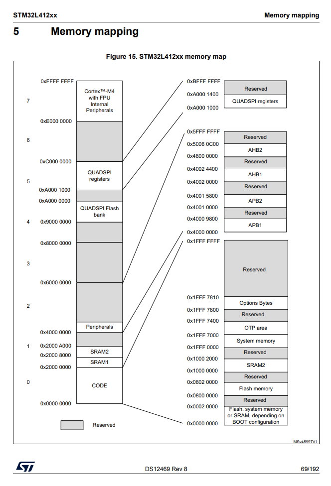

第三章では、第二章で扱ったハードウェアの実装を念頭に、作成した基板をキーボードとして動作させるためのソフトウェアの実装方法を紹介します。
例として第二章で取り上げた構成やMCUを使いますが、他の構成でも利用可能な情報になるよう気をつけました。
リファレンスマニュアルやデータシートを参照している箇所はそれぞれお使いのMCUの情報に読み替えてください。

# 環境構築

今後の節ではMCUプログラミングを基礎から解説していきます。
実際に手元のデバイスで実験するために先に環境構築を済ませてしまいましょう。
イマイチ原理や目的がわからない部分もあるだろうと思いますが、ガイダンスに沿ってセットアップしてみてください。

ソフトウェアはすべてLinux、macOS、Windowsで共通のものが使えます。
ダウンロード・インストール方法が異なるものは適宜読み替えてください。

## Rust

Rust言語で実装したファームウェアをコンパイルするために必要です。
[Install Rust](https://www.rust-lang.org/tools/install)の手順にそってインストールしてください。
完了後、`rustup`と`cargo`が使えることを確認してください。
`cargo`はRustのパッケージマネージャ兼ビルドシステムです。

## [cargo-binutils](https://github.com/rust-embedded/cargo-binutils)

cargoのサブコマンドを追加しdfu-utilで書き込み可能なバイナリファイルを作成するために必要です。
[ReadmeのInstallation](https://github.com/rust-embedded/cargo-binutils#installation)に従ってインストールしてください。
あとでCargoプロジェクトを作成してから`cargo objcopy`が実行できれば成功です。

## ARMターゲット

利用するMCUのアーキテクチャに対応したコードを出力するために、ターゲットを追加する必要があります。
ここで指定する引数はMCUによって異なります。
[Crate cortex_m_quickstart](https://docs.rust-embedded.org/cortex-m-quickstart/cortex_m_quickstart/#usage)によると

- Use thumbv6m-none-eabi for ARM Cortex-M0 and Cortex-M0+
- Use thumbv7m-none-eabi for ARM Cortex-M3
- Use thumbv7em-none-eabi for ARM Cortex-M4 and Cortex-M7 (no FPU support)
- Use thumbv7em-none-eabihf for ARM Cortex-M4F and Cortex-M7F (with FPU support)

という対応関係のようです。
[STM32L412](https://www.st.com/en/microcontrollers-microprocessors/stm32l412kb.html)のページに「Ultra-low-power with FPU Arm Cortex-M4 MCU 80 MHz with 128 Kbytes of Flash memory, USB」とありますので、Cortex-M4Fになります。
なおFPUとはFloating Point Unit、浮動小数点演算器です。
利用したMCUのページを確認して必要なものを次のように追加します。

```
rustup target add thumbv7m-none-eabi
```

## dfu-util

USB DFUを使ってファームウェアを書き込むために必要です。
[dfu-util公式サイト](http://dfu-util.sourceforge.net/)でバイナリが配布されています。
macOSであればhomebrewで、UbuntuなどはOSのパッケージマネージャでもインストールできます。

## openocd (ST-Link利用時のみ)

ST-Linkを利用してデバッグする場合、ホストコンピュータとST-Linkの通信に必要です。
[入手方法](http://openocd.org/getting-openocd/)を参考にインストールしてください。
Windows以外では標準的なパッケージマネージャで提供されているようです。
Windowsはコンパイル済バイナリがインターネットに転がっています。

## gdb (ST-Link利用時のみ)

ST-Linkを利用してデバッグする場合、openocdを経由してプログラムをロードしたりデバッグするのに利用します。
ホストコンピュータのアーキテクチャ用のものではなく、MCUのアーキテクチャ用のものが必要です。
[GNU Arm Embedded Toolchain Downloads](https://developer.arm.com/tools-and-software/open-source-software/developer-tools/gnu-toolchain/gnu-rm/downloads)から入手できます。
また標準的なパッケージマネージャでも提供されているようです。

## 最初のプロジェクト

(TODO)

# MCUをプログラミングするとは

ソフトウェアを実装するにあたり、どんな仕組みでMCUをプログラミングできるのか理解しておくことが重要です。
コピーペーストでもHello World相当のプログラムを動かすのは簡単ですが、自分のためのキーボードを工夫するには基礎知識があったほうがよいでしょう。
この節ではリファレンスマニュアルを読んだり、プログラミングを進める時に何をやっているのか理解できるだけの背景知識をお伝えします。
やりたいこと、リファレンスマニュアルの情報、Rustのコードを対応づけ、意味がわかりやすいようにしました。
すでにコンピュータサイエンスとSoCの基礎を理解している場合は飛ばしてもかまいません。

## 最も簡単なプログラム

最も簡単な、けれども動作していると分かるプログラムを考えてみましょう。
代表的なのはLチカ(blink)です。
しかしこの文書のトピックはキーボードですから、ボタン入力も受け取りたいです。
まずはボタン入力を受け取り、LEDを光らせるものを作ってみましょう。
自分の基板にLEDがない場合、適当なパッドとGNDにはんだ付けしてしまえばOKです。
あとで取り外せば支障ありません。

(TODO:写真)

次のようなプログラムを実装します。

```
ボタンが押されているか？
押されていたらLEDを光らす、押されていなかったら消す。
```

とっても簡単そうにみえます。
この機能のためにMCUの中でどんな動作が起きているか理解するには手頃なサイズの課題でしょう。

まずこの機能を実現する方法をMCUの視線で考えます。
この段階ではまだ自然言語で表現されます。
MCUの用語を使って表現し直してみましょう。

ボタンが押されているか知る、LEDのON、OFFを制御するなどのインタラクションはGPIO(General Purpose Input Output)をつかって行います。
基板を設計する段階でキースイッチの2端子のうち少なくとも一方はGPIOに接続するよう配線されているでしょう。
Nucleoなど開発ボードを利用している場合はマニュアルを読んでGPIOとして使えるピンにボタンとLEDを接続してください。
仮にボタンがPA0、LEDがPB2に繋がっているとします。
またボタンもLEDも反対側の足はGNDに繋がっているとします。
VCCに繋がっている場合はHIGHとLOWを逆に読み替えてください。
基板をスイッチマトリクス式に設計した場合は反対の線をLOWにしてください。

最初の案をMCUの用語で書くと次のようになります。
ボタンはONのとき反対側のGNDとおなじ電位になるのでLOWになります。
LEDはONにしたいとき反対側のGNDより十分高い電位にするのでHIGHにしたいです。

```
PA0がLOWか？
LOWならPB2をHIGHにする、HIGHならPB2をLOWにする。
```

HIGH/LOWが真偽値とみなせることを利用すると

```
PB2のHIGH/LOWをPA0のHIGH/LOWの反対の状態にする。
```

とまとめられます。
このプログラムを書くことを目指します。

Rustプログラムを書く前に、データシートとマニュアルを読みこの条件を机上で考えてみましょう。

[RM0394 (PDF)](https://www.st.com/resource/en/reference_manual/dm00151940-stm32l41xxx42xxx43xxx44xxx45xxx46xxx-advanced-armbased-32bit-mcus-stmicroelectronics.pdf)のChapter 8がGPIOに関する章です。
たくさん説明が書いてありますが、ひとまず読み飛ばして8.4 GPIO Registersまで進みます。
さらに下っていくと

> 8.4.5 GPIO port input data register (GPIOx_IDR) (x = A to E and H)

という部分があります。
input dataとありますから、この部分を使えばボタンにつながるGPIOの状態を受け取ることができそうです。
またその次には

> 8.4.6 GPIO port output data register (GPIOx_ODR) (x = A to E and H)

とあります。
output dataはGPIOの値を設定しLEDにつながるGPIOを制御できそうです。

## MCUの仕組み

register(レジスタ)という概念がでてきました。
レジスタとはMCUの仕組みの一部です。
よいタイミングなので、レジスタを説明しつつ、ほかのMCUの最も根本的な仕組みも解説します。
すこし概念的な話になります。

わかりにくいとお叱りを受けるかもしれないので先に断っておくとこの話を理解しなくてもMCUのプログラミングは可能です。
なにかうまく行かないときにデバッガを使ったり問題の切り分けを行うのに役立つ知識です。

MCUは単機能しかもたないICと異なり、プログラムを書き換えて様々な動作を実現します。
どうしてそんなことができるかというと、MCUが実行する処理を変更できるからです。
実行する処理の指定を命令(instruction)、使える命令をまとめたものを命令セット(instruction set)と呼びます。
MCUは利用者が中の記憶領域(flash)を変更し、実行したい命令列を自由に設定できる仕組みを持っています。

MCUの中には3種類の記憶領域があります。
レジスタ(register)、RAM、flashです。
レジスタはさらにprocessor registersとperipheral registers（あるいは hardware registers）に分けられます。
Processor registersはMCU内部の処理を適切に流すためのレジスタです。
すべての計算に使われる値はprocessor registersの一部であるgeneral purpose registersに保存されます。
MCUで1+2を計算するには

- R0（1つめのgeneral purpose register）に1をセット
- R1に2をセット
- R0とR1の和をR0に上書き

などと記述します。
いきなり1と2を足せばいいじゃないか、とバカバカしく感じられるかもしれませんが、シンプルな命令を組み合わせる仕組みのほうが考えることが減ってMCUやコンパイラを設計する人は楽になります。

ほかのprocessor registersには今命令列のどこを実行しているかを示すprogram counterやスタックの先頭を示すstack pointerがあります。
命令列は通常ひとつずつ順に処理されます。
すなわちprogram counterは通常1単位ずつ増えます。
ARMv7では1つの命令が32ビット=4バイトなので、program counterはひとつ命令を処理するごとに4、8、12、16と増えていきます。
例外は分岐やプロシージャ呼び出し（手続き呼び出し、やや不正確ですが、関数呼び出しと呼ばれることもあります）です。
次のような疑似コードを考えます。

```
if (x == 1) {
  print(1)
} else {
  print(0)
}
```

命令列は列というくらいなので、一直線です。
分岐やプロシージャなどの入れ子構造は表現できません。
そこでprogram counterが役に立ちます。

`if (x == 1)`の部分は「もしレジスタR0の値が1だったらそのまま継続、そうじゃなかったらprogram counterをelseの中の先頭のところまで増やす」と表現できます。
`print(1)`はどこか別の部分にprintの命令列が置いてあるので、その場所にprogram counterを移動すればよいです。

疑似的な命令列では次のようになります

```
# 変数xの値はR0に入っているものとします
- もしレジスタR0の値が1だったらそのまま継続、そうじゃなかったらprogram counterを3つ先まで増やす
- R0に即値1をセット
- printの手続きがおかれたアドレスをprogram counterにセット # プロシージャ呼び出し
- program counterを2つ先に移動してプログラムの最後にジャンプ # 次の行からの処理は x == 1 のとき実行しないので、スキップ
- R0に即値1をセット
- printの手続きがおかれたアドレスをprogram counterにセット # プロシージャ呼び出し
```

いちいちこのような処理を考えてプログラムを書くことはありません。
デバッガでステップ実行をする時にアセンブリやprogram counterの仕組みがなんとなくわかっているとスムーズです。
スタックについては後で説明します。

Peripheral registerはPeripheralすなわち周辺機器を制御するためのレジスタです。
さきほどの「GPIO port input data register」はGPIO portというperipheralを扱うので、peripheral registerに分類されます。
general purpose registerが計算に利用されるのに対し、peripheral registersは用途が決まっているので計算できません。
その他のproccessor registerがプロセッサの挙動をコントロールするのに対し、peripheral registersはperipheralを使いたいときだけ利用します。
input data registerであればMCUのハードウェアがピンの電位を検出しレジスタの値を適切に調整してくれる、ソフトウェアは好きなタイミングでその値を取得します。
ソフトウェアが外界の様子を知る、外界に影響を与える窓口がレジスタという形で提供されていると見なせます。

RAMとflashはいずれもソフトウェアからはメモリに見えます。
RAMは揮発性で電源を抜いたら消えてしまいます。
flashは不揮発性で電源を抜いても次に起動するときまで同じ内容が維持されます。
flashは書き込み可能回数が少なく（といっても1万回以上）、RAMより書き込みに時間がかかります。
そこでflashはプログラムの保持や設定の記録に、RAMはプログラム実行中の主記憶として使われます。

RAM、主記憶はなぜ必要なのでしょうか。
さきほど計算に使う値はgeneral purpose registersに保持すると説明しました。
しかしgeneral purpose registersはたった13個しかありません（STM32L412の場合。アーキテクチャにより異なります）。
しばらく使わない値はRAMに置けば、general purpose registersを他の計算に使えるように空けられます。
この値を置く場所をスタックと呼びます。
スタックはその名のとおり新しく値を上にどんどん積み重ねていく決まりになっています。
メモリはレジスタに比べればたくさんありますが、それでも有限です。
あまりに積みすぎると使い切ってしまいます。
これが有名な技術QAサイトの名前にもなっているStack Overflowです。

複数の箇所からアクセスされるグローバル変数はプログラム全体で固定の場所にあるべきです。
registerを1つ専有してしまうと大変邪魔ですが、RAMに置いておけばその位置を読み書きすることで役目が果たせます。
このように利用される領域をヒープと言います。
RAMはヒープとスタックに分けて利用されます。

flashは上述のとおり主にプログラムを置きます。
現行のほとんどのCPU、MCUはノイマン型コンピュータと呼ばれます。
ノイマン型コンピュータでは処理対象のデータと処理をするプログラムがおなじメモリに置かれる特徴があります。
プログラム実行中にメモリ上に新しいプログラムを書き込み、それを実行できます。
この背景により、flashとRAMもソフトウェアにとっては一連のメモリ領域に見えます。
[stm32l412xxのデータシート (PDF)](https://www.st.com/resource/en/datasheet/stm32l412c8.pdf)には次のように図解されています。
CODEのなかにflashがあり、CODEの上につながるようにSRAM1が置かれています。



flashへのプログラム書き込みには複数の方法があります。
本稿ではおもにUSB-DFU bootloaderを使いますが、SWDを使いST-Link経由でも書き込めます。
MCUのアーキテクチャとして命令の表現方法や配置方法が定められています。
そのとおりのファイルを作ってDFUで書き込めばMCUを好きに動かせる仕組みです。

ざっくりではありますが、MCUがレジスタ、RAM、flashを使って命令列であるプログラムをどのように実行するか説明しました。
次は実際にプログラムを作成しましょう。

## 簡単なプログラムを完成させる

これを[STM3L4 Crate](https://lib.rs/crates/stm32l4)をつかったRustプログラムでは次のように表現します。


```
(TODO: 検証)
// import crate
use stm32l4::stm32l4x1;

// Create interface object of peripherals
let mut peripherals = stm32l4x1::Peripherals::take().unwrap();
// Get GPIO A accessor
let gpioa = &peripherals.GPIOA;
// Get GPIO B accessor
let gpiob = &peripherals.GPIOB;

if (gpioa.idr.read().idr0().is_bit_set()) {
  gpiob.odr.modify(|_, w| w.odr2().clear_bit());
} else {
  gpiob.odr.modify(|_, w| w.odr2().set_bit());
}

// Or
let is_on = gpioa.idr.read().idr0().is_bit_set();
gpiob.odr.modify(|_, w| w.odr2().bit(!is_on));
```


## プログラムを書き込む

# ライブラリの紹介
# 枠組みの実装
